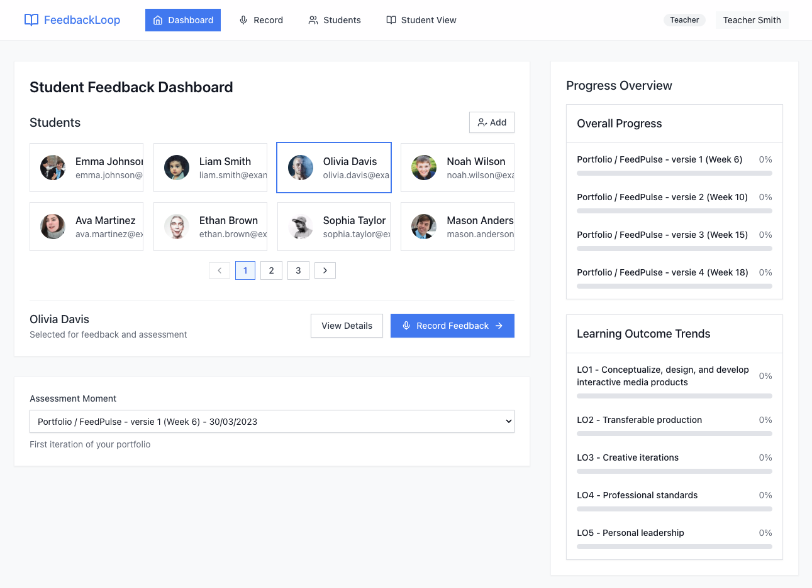

# FeedbackLoop



## Overview
FeedbackLoop is an innovative application designed to facilitate meaningful feedback exchanges between teachers and students. By transcribing conversations into text, the tool automatically categorizes feedback and feedforward according to specific learning outcomes. This structured approach helps students clearly understand their progress and areas for improvement, providing a transparent and effective learning process.

## Key Features
Automated Transcription: Converts spoken conversations into text for easy review.
Categorized Feedback: Organizes feedback and feedforward based on specific learning objectives.
Student Progress Tracking: Displays a clear process for students to visualize their learning journey.

## Purpose
FeedbackLoop enhances the learning experience by making feedback more accessible, structured, and actionable. It empowers students with clear guidance while helping educators streamline their assessment and support processes.

## Used technologies

### Application technologies


### Create and build technologies


### AI technologies


## Installation

### Prerequisites
Make sure you have the following installed:
- [Node.js](https://nodejs.org/) (Latest LTS recommended)
- [npm](https://npm.io/)

### Steps
1. Clone the repository:
   ```sh
   git clone https://github.com/docentDavid/feedbackloopgrovemain.git
   cd feedbackloopgrovemain
   ```
2. Install dependencies:
   ```sh
   npm install
   ```
3. Run the development server:
   ```sh
   npm run dev
   ```
4. Open your browser and navigate to:
   ```
   http://localhost:3000
   ```

## Configuration
- Environment variables can be configured in a `.env.local` file.
- Update `next.config.mjs` for custom Next.js settings.

## Scripts
| Command       | Description                     |
|--------------|---------------------------------|
| `npm run dev`   | Run the development server     |
| `npm run build` | Build the production version   |
| `npm start`     | Start the production server    |
| `npm run lint`  | Lint the code                  |


## Contributing
Contributions are welcome! Please submit a pull request or open an issue for discussion.

## License
This project is licensed under the MIT License.
